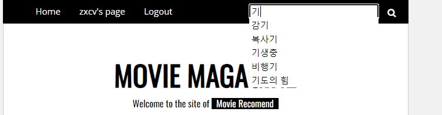

## 팀원 정보 및 업무 분담 내역

- 공동작업

## 목표 서비스 구현 및 실제 구현 정도

### 목표 서비스

- 유저별 영화 추천 서비스 제공(알고리즘)

  - 좋아요 순위가 높은 배우, 감독 top3명과 관련된 영화 추천

    - 구현O

  - 24시간 내에 가장 좋아요를 많이받은 영화 추천

    - 구현O

  - 모든 배우, 감독에 대해 유저의 선호도가 높을수록 마이너한 영화 추천

    - 구현O

    

- 서비스사용시 접근성 확보( UI/UX)

  - 비 로그인시에도 검색, 기본적인 추천알고리즘 접근 허용
    - 구현O
  - 영화정보가 노출되는 모든 페이지에서 `좋아요`, `봤어요` 적용 가능
    - 구현O
  - 검색기능
    - 부분 구현
    - 검색결과 페이지에서 재검색 불가
  - 검색결과 일치도 관련정보, 추천검색어 제공
    - 구현O
  - 유저, 배우, 감독, 영화별 디테일페이지 제공

## 데이터베이스 모델링 (ERD)

## 필수 기능에 대한 설명

- 좌측:
  - 선호하는 배우, 감독을 기준으로 유저 맞춤 영화 추천
- 우측:
  - 24시간동안 모든 유저가 좋아요를 가장 많이 누른 영화 추천
  - 최신 개봉영화 추천

- 유저별 선호배우, 감독 확인 및 레벨, 본 영화목록을 제공.

- 추천검색어 제공

- 일치도별 정보제공

## 기타